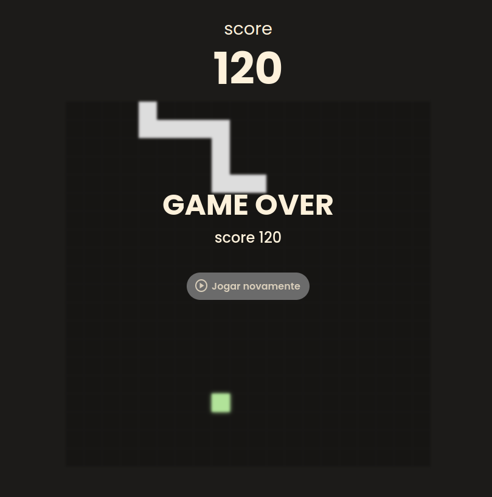

# Jogo da Cobrinha

Bem-vindo ao **Jogo da Cobrinha**! Esta é uma implementação simples do clássico jogo da cobrinha usando HTML, CSS e JavaScript.

## 🎮 Instruções do Jogo

- Use as setas do teclado para controlar a direção da cobrinha.
- Coma a comida colorida para crescer e aumentar sua pontuação.
- Evite colidir com as paredes ou com o próprio corpo!

## 🚀 Como Começar

### Pré-requisitos

Você só precisa de um navegador web para jogar o jogo.

### Instalação

1. Clone o repositório:

```bash
git clone https://github.com/robertotics4/snake-game
```

2. Navegue até o diretório do projeto:

```bash
cd snake-game
```

3. Abra o arquivo `index.html` no seu navegador web para iniciar o jogo.

## 🛠️ Construído Com

- **HTML5** - Linguagem de marcação para estruturar o jogo.
- **CSS3** - Estilo para a interface do jogo.
- **JavaScript** - Lógica e interatividade do jogo.

## 📝 Licença

Este projeto está licenciado sob a Licença MIT - veja o arquivo [LICENSE](LICENSE) para mais detalhes.

## 📷 Screenshot



## 🙌 Agradecimentos

- Inspirado no clássico jogo da cobrinha que muitos de nós jogamos nos primeiros dias dos celulares.
- Agradecimentos a todos os desenvolvedores e comunidades que fornecem ótimos recursos para aprender e construir jogos.

## 📧 Contato

Sinta-se à vontade para entrar em contato se tiver alguma pergunta ou sugestão.

- **GitHub**: [robertotics4](https://github.com/robertotics4)